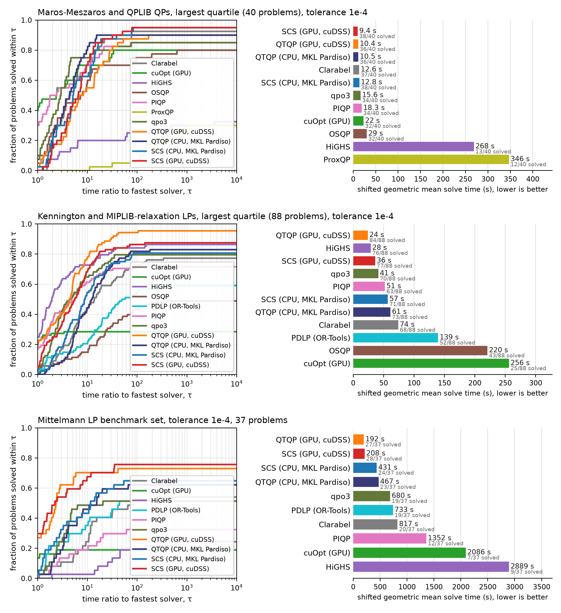
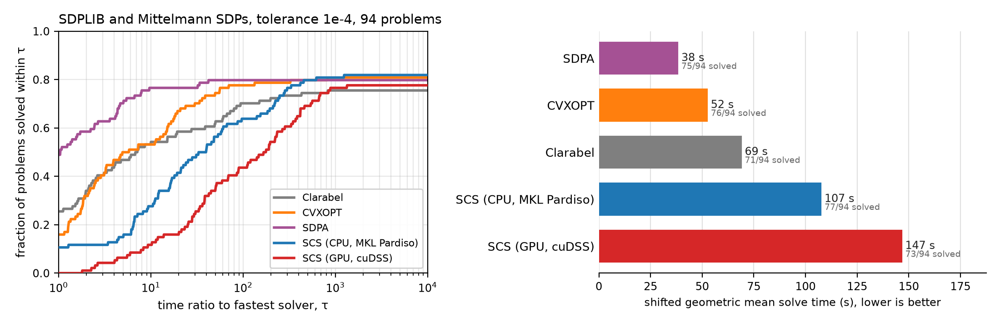
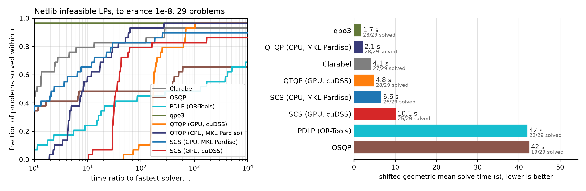

# solver_benchmarks_results

Raw results of benchmark campaigns run with [bodono/solver_benchmarks](https://github.com/bodono/solver_benchmarks).
One directory per campaign. Each `merged/<family>/` is a run directory the harness reads directly
(`results.jsonl` with one row per (dataset, problem, solver) solve, and its `manifest.json`), so

```bash
bench kkt-verify scs33_2026-09/merged/qp --tol 1e-3 --promote --output-dir /tmp/qp_verified
bench report /tmp/qp_verified
```

reproduce the verified counts and tables from the raw rows. Every row carries the harness's independent
KKT residuals (or certificate residuals for infeasible / unbounded claims) computed from the problem
data, independent of what the solver reported.

| Campaign | What | Site |
|---|---|---|
| [`scs33_2026-09`](scs33_2026-09/) | Clarabel, CVXOPT, cuOpt, HiGHS, OSQP, PDLP, PIQP, ProxQP, qpo3, QTQP, SCS 3.3.1 and SDPA on QP, LP, Mittelmann LP, SDP and infeasible problems | run for the [SCS 3.3 benchmarks page](https://www.cvxgrp.org/scs/benchmarks/), which shows a subset |

Largest quarter of the QP and LP sets and the Mittelmann LP set, at 1e-4:



SDPLIB and the Mittelmann SDPs at 1e-4:



Infeasibility detection on the Netlib infeasible LPs (a solve is a verified certificate):



Each campaign directory has a README with the plots and headline tables for every solver and test set
(for example [`scs33_2026-09/README.md`](scs33_2026-09/README.md)). The complete archive of each campaign (raw per-shard results, verified runs at every threshold,
Modal logs) is attached to the campaign's GitHub release.
