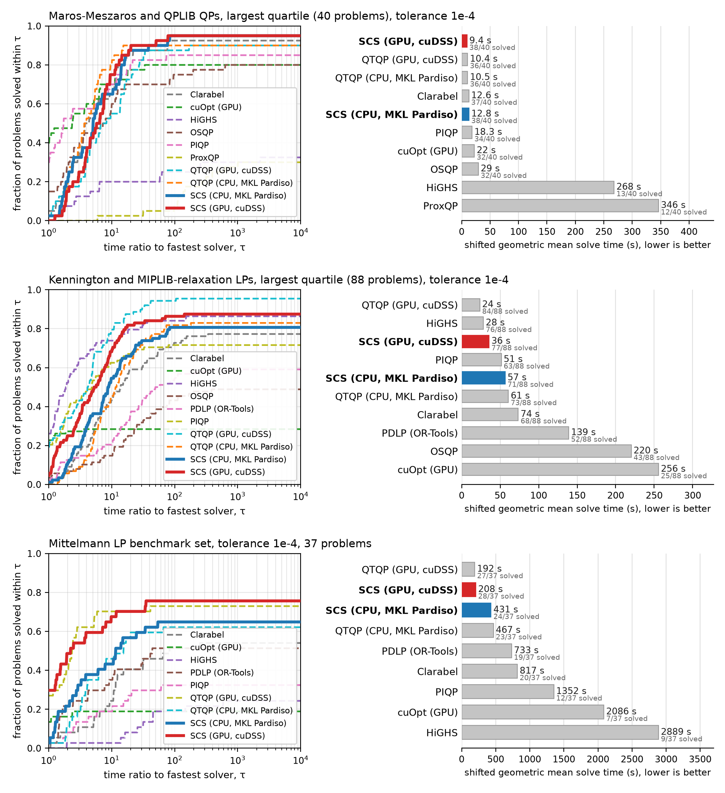
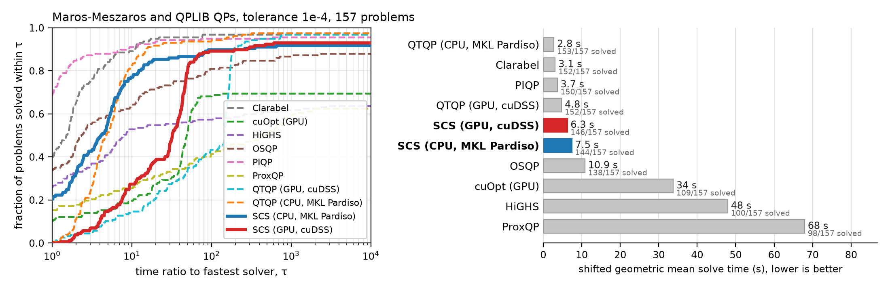
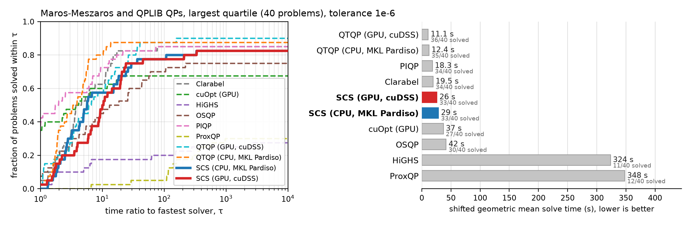
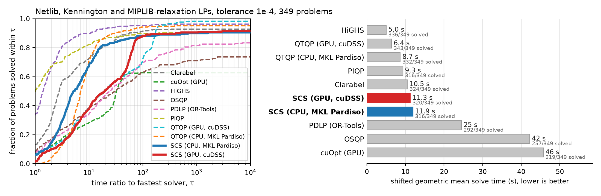
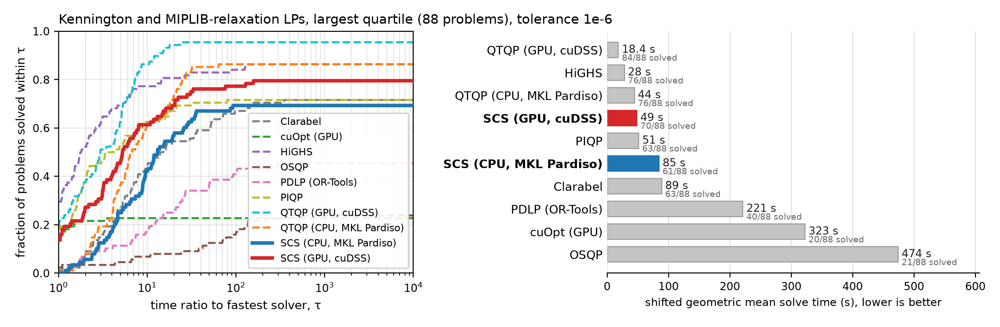
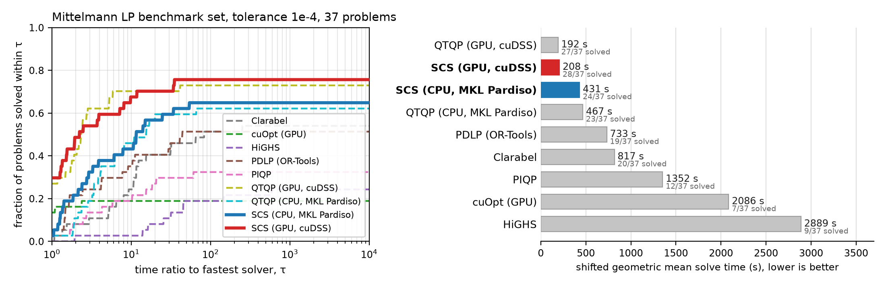
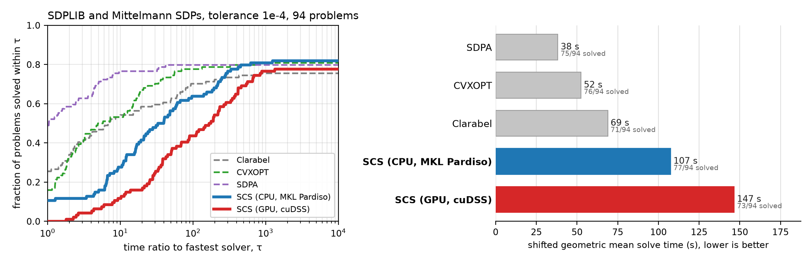
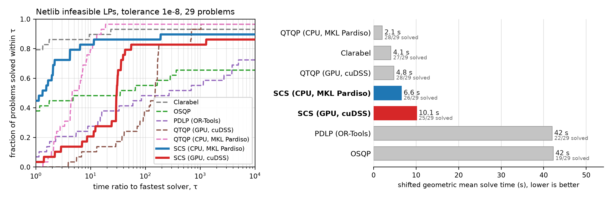
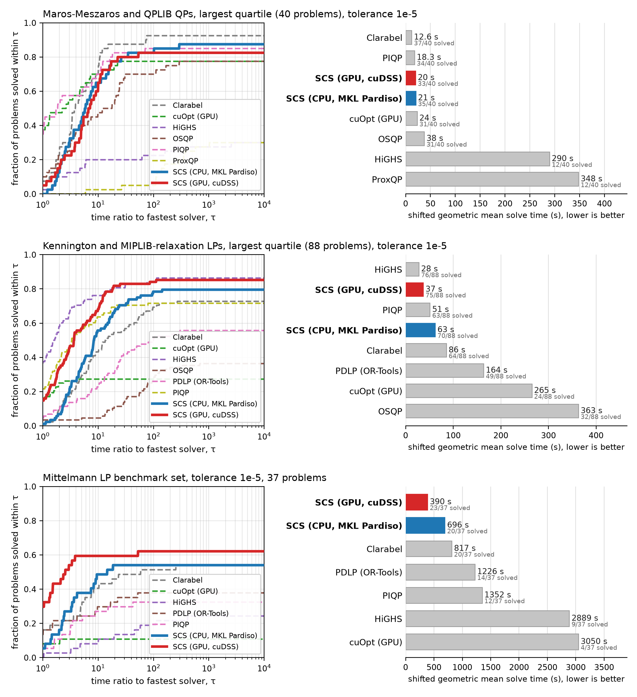

# SCS 3.3 benchmark campaign, September 2026

SCS 3.3.1 against Clarabel, PIQP, OSQP, ProxQP, HiGHS, PDLP (OR-Tools), NVIDIA cuOpt, CVXOPT, SDPA and QTQP on standard QP, LP, SDP and infeasible test sets, run on Modal in identical containers (A100-80GB for the GPU backends). Every solve is re-verified from the problem data at ten times the plot's target tolerance, so a "solve" below means a verified solution, whatever the solver reported; failures are charged three times the time limit in the shifted geometric means (shift 10 s). Interior-point solvers are shown from their 1e-6 runs (Clarabel 1e-8 on SDP, QTQP 1e-8 everywhere) and PDLP and ProxQP from their 1e-5 runs, matched by achieved accuracy; see [MANIFEST.md](MANIFEST.md) for versions, hardware and the exact rules, and [the SCS benchmarks page](https://www.cvxgrp.org/scs/benchmarks/) for the published subset (without QTQP).

Table cells read *verified solves / problems · shifted geometric mean time*. Raw rows for every solver, tolerance and problem are in [`merged/`](merged/).

## Headline

Largest quarter of the QP and LP sets and the Mittelmann LP set, at 1e-4:

## Quadratic programs

Maros-Meszaros (138) and QPLIB (19): 157 problems, 300 s limit.

| Solver | 1e-4, all | 1e-4, largest quartile | 1e-6, all | 1e-6, largest quartile |
|---|---|---|---|---|
| QTQP (CPU, MKL Pardiso) | 153/157 · 2.8 s | 36/40 · 10.5 s | 151/157 · 3.0 s | 35/40 · 12.4 s |
| Clarabel | 152/157 · 3.1 s | 37/40 · 12.6 s | 148/157 · 4.4 s | 34/40 · 19.5 s |
| PIQP | 150/157 · 3.7 s | 34/40 · 18.3 s | 150/157 · 3.7 s | 34/40 · 18.3 s |
| QTQP (GPU, cuDSS) | 152/157 · 4.8 s | 36/40 · 10.4 s | 152/157 · 4.3 s | 36/40 · 11.1 s |
| **SCS (GPU, cuDSS)** | 146/157 · 6.3 s | 38/40 · 9.4 s | 140/157 · 12.2 s | 33/40 · 26.1 s |
| **SCS (CPU, MKL Pardiso)** | 144/157 · 7.5 s | 38/40 · 12.8 s | 138/157 · 11.4 s | 33/40 · 28.8 s |
| OSQP | 138/157 · 10.9 s | 32/40 · 29.4 s | 121/157 · 27.2 s | 30/40 · 41.8 s |
| cuOpt (GPU) | 109/157 · 33.8 s | 32/40 · 22.4 s | 103/157 · 39.6 s | 27/40 · 37.1 s |
| HiGHS | 100/157 · 48.0 s | 13/40 · 268.1 s | 84/157 · 79.1 s | 11/40 · 323.6 s |
| ProxQP | 98/157 · 67.9 s | 12/40 · 346.3 s | 84/157 · 88.9 s | 12/40 · 348.0 s |

Largest quartile at 1e-6:

## Linear programs

Netlib (93), Kennington (16) and the 240 MIPLIB 2017 relaxations: 349 problems, 300 s limit.

| Solver | 1e-4, all | 1e-4, largest quartile | 1e-6, all | 1e-6, largest quartile |
|---|---|---|---|---|
| HiGHS | 336/349 · 5.0 s | 76/88 · 28.2 s | 336/349 · 5.0 s | 76/88 · 28.2 s |
| QTQP (GPU, cuDSS) | 343/349 · 6.4 s | 84/88 · 23.5 s | 322/349 · 10.2 s | 84/88 · 18.4 s |
| QTQP (CPU, MKL Pardiso) | 332/349 · 8.7 s | 73/88 · 60.7 s | 314/349 · 12.1 s | 76/88 · 44.4 s |
| PIQP | 316/349 · 9.3 s | 63/88 · 51.5 s | 310/349 · 10.6 s | 63/88 · 51.5 s |
| Clarabel | 324/349 · 10.5 s | 68/88 · 73.5 s | 312/349 · 13.4 s | 63/88 · 88.9 s |
| **SCS (GPU, cuDSS)** | 320/349 · 11.3 s | 77/88 · 35.6 s | 303/349 · 17.0 s | 70/88 · 48.6 s |
| **SCS (CPU, MKL Pardiso)** | 316/349 · 11.9 s | 71/88 · 56.5 s | 295/349 · 19.9 s | 61/88 · 84.7 s |
| PDLP (OR-Tools) | 292/349 · 24.5 s | 52/88 · 139.0 s | 263/349 · 38.6 s | 40/88 · 221.3 s |
| OSQP | 257/349 · 42.2 s | 43/88 · 220.1 s | 174/349 · 131.9 s | 21/88 · 474.3 s |
| cuOpt (GPU) | 219/349 · 45.7 s | 25/88 · 255.6 s | 204/349 · 56.9 s | 20/88 · 322.6 s |

Largest quartile at 1e-6:

## Large linear programs: the Mittelmann set

37 problems, 1800 s limit, 64 GB containers.

| Solver | 1e-4, all | 1e-4, largest quartile |
|---|---|---|
| QTQP (GPU, cuDSS) | 27/37 · 192.0 s | 3/10 · 1775.6 s |
| **SCS (GPU, cuDSS)** | 28/37 · 207.5 s | 3/10 · 1633.4 s |
| **SCS (CPU, MKL Pardiso)** | 24/37 · 431.3 s | 2/10 · 3247.6 s |
| QTQP (CPU, MKL Pardiso) | 23/37 · 466.8 s | 2/10 · 3320.5 s |
| PDLP (OR-Tools) | 19/37 · 732.7 s | 1/10 · 4717.2 s |
| Clarabel | 20/37 · 817.0 s | 2/10 · 3453.8 s |
| PIQP | 12/37 · 1352.2 s | 1/10 · 3797.8 s |
| cuOpt (GPU) | 7/37 · 2086.0 s | 1/10 · 2955.0 s |
| HiGHS | 9/37 · 2888.8 s | 1/10 · 3444.0 s |

## Semidefinite programs

SDPLIB (88 feasible) and the Mittelmann SDPs (6): 94 problems, 900 s limit.

| Solver | 1e-4, all | 1e-4, largest quartile | 1e-6, all | 1e-6, largest quartile |
|---|---|---|---|---|
| SDPA | 75/94 · 38.2 s | 21/24 · 38.6 s | 69/94 · 58.6 s | 21/24 · 38.6 s |
| CVXOPT | 76/94 · 52.4 s | 18/24 · 111.5 s | 62/94 · 132.5 s | 16/24 · 178.6 s |
| Clarabel | 71/94 · 68.9 s | 13/24 · 257.0 s | 69/94 · 75.7 s | 12/24 · 283.1 s |
| **SCS (CPU, MKL Pardiso)** | 77/94 · 107.5 s | 14/24 · 1090.7 s | 51/94 · 274.0 s | 2/24 · 2455.8 s |
| **SCS (GPU, cuDSS)** | 73/94 · 146.5 s | 9/24 · 1531.0 s | 0/94 · 2700.0 s | 0/24 · 2700.0 s |

## Infeasible and unbounded problems

Netlib's 29 infeasible LPs (two of them also dual infeasible) and SDPLIB's four infeasible SDPs (two primal infeasible, two unbounded). SCS, Clarabel, OSQP, PDLP, CVXOPT and QTQP return a certificate (a Farkas ray), checked from the problem data at the 1e-3 threshold; HiGHS, PIQP, cuOpt and SDPA report a status only. A verified certificate of either kind counts as correct; "near-feasible" is an optimal claim whose residuals pass the check (the instance is infeasible by less than the tolerance). Each solver is shown from the run in which it certified the most; the plot uses the same rule.

### Netlib infeasible LPs

29 problems.

| Solver | certified | status only | unverified | near-feasible | wrong | no answer | geomean time |
|---|---|---|---|---|---|---|---|
| **SCS (CPU, MKL Pardiso), 1e-4** | 24 | 0 | 0 | 2 | 3 | 0 | 0.20 s |
| **SCS (CPU, MKL Pardiso), 1e-8 (infeasibility tolerance 1e-4)** | 26 | 0 | 0 | 1 | 1 | 1 | 0.44 s |
| **SCS (GPU, cuDSS), 1e-8 (infeasibility tolerance 1e-4)** | 25 | 0 | 0 | 1 | 1 | 2 | 0.93 s |
| Clarabel, 1e-8 (infeasibility tolerance 1e-4) | 27 | 0 | 1 | 1 | 0 | 0 | 0.35 s |
| QTQP (CPU, MKL Pardiso), 1e-8 | 28 | 0 | 0 | 1 | 0 | 0 | 0.33 s |
| QTQP (GPU, cuDSS), 1e-8 | 28 | 0 | 0 | 1 | 0 | 0 | 2.78 s |
| PIQP, 1e-6 | 0 | 17 | 0 | 0 | 0 | 12 | 0.29 s |
| HiGHS, 1e-6 | 0 | 26 | 0 | 0 | 0 | 3 | 0.02 s |
| OSQP, 1e-8 | 19 | 0 | 0 | 0 | 0 | 10 | 1.68 s |
| PDLP (OR-Tools), 1e-5 | 22 | 0 | 2 | 0 | 0 | 5 | 10.91 s |
| cuOpt (GPU), 1e-4 | 0 | 27 | 0 | 0 | 1 | 1 | 0.40 s |

### SDPLIB infeasible SDPs

4 problems.

| Solver | certified | status only | unverified | near-feasible | wrong | no answer | geomean time |
|---|---|---|---|---|---|---|---|
| **SCS (CPU, MKL Pardiso)** | 4 | 0 | 0 | 0 | 0 | 0 | 0.04 s |
| **SCS (GPU, cuDSS)** | 4 | 0 | 0 | 0 | 0 | 0 | 0.70 s |
| Clarabel (infeasibility tolerance 1e-4) | 4 | 0 | 0 | 0 | 0 | 0 | 0.20 s |
| CVXOPT | 0 | 0 | 2 | 0 | 2 | 0 | – |
| SDPA | 0 | 4 | 0 | 0 | 0 | 0 | 0.03 s |

## Sensitivity

The same headline rows with every first-order solver re-run at a 1e-5 target (interior-point rows unchanged):

