# Solver benchmark campaign, September 2026

Clarabel, CVXOPT, cuOpt, HiGHS, OSQP, PDLP (OR-Tools), PIQP, ProxQP, QTQP, SCS 3.3.1 and SDPA on standard QP, LP, SDP and infeasible test sets, run on Modal in identical 4-core containers (A100-80GB for the GPU backends). Every solve is re-verified from the problem data at ten times the plot's target tolerance, so a "solve" below means a verified solution, whatever the solver reported. Failures are charged three times the time limit in the shifted geometric means (shift 10 s); a solve finishing after the limit plus 60 s counts as a failure. Because a requested tolerance means different things to different solvers, each plot shows every solver from the run whose achieved accuracy matches the plot's target: SCS, OSQP and cuOpt from the run at the nominal tolerance, PDLP and ProxQP from one decade tighter, the interior-point solvers Clarabel, PIQP, HiGHS, SDPA and CVXOPT from their 1e-6 runs (Clarabel 1e-8 on SDP) and QTQP from its 1e-8 run. See [MANIFEST.md](MANIFEST.md) for versions, hardware and the full rules.

Table cells read *verified solves / problems · shifted geometric mean time*. "Largest quartile" is the quarter of the family with the most nonzeros. Raw rows for every solver, tolerance and problem are in [`merged/`](merged/) and per-problem status and times in [`per_problem/`](per_problem/).

## Headline

Largest quarter of the QP and LP sets and the Mittelmann LP set, at 1e-4 (top) and 1e-5 (bottom):

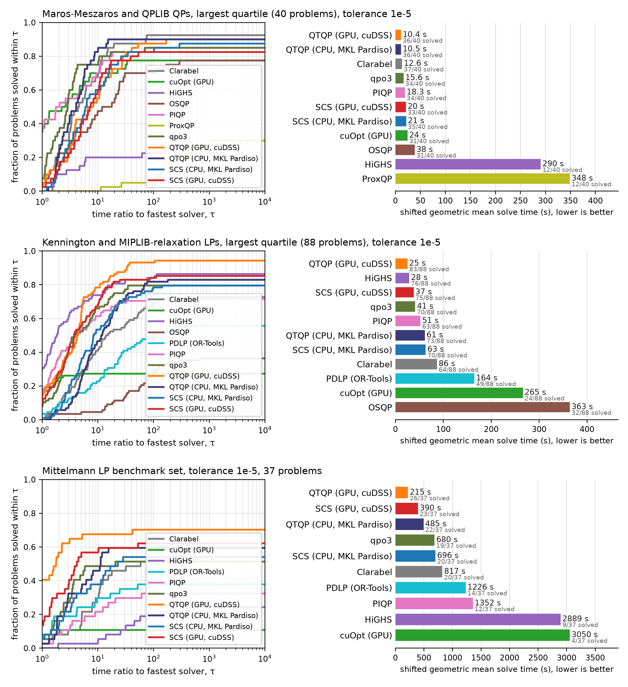

## Quadratic programs

Maros-Meszaros (138) and QPLIB continuous convex (19): 157 problems, 300 s limit.

| Solver | 1e-4, all | 1e-4, largest quartile | 1e-5, all | 1e-5, largest quartile | 1e-6, all | 1e-6, largest quartile |
|---|---|---|---|---|---|---|
| QTQP (CPU, MKL Pardiso) | 153/157 · 2.8 s | 36/40 · 10.5 s | 152/157 · 3.1 s | 36/40 · 10.5 s | 152/157 · 3.1 s | 36/40 · 10.5 s |
| Clarabel | 152/157 · 3.1 s | 37/40 · 12.6 s | 152/157 · 3.1 s | 37/40 · 12.6 s | 148/157 · 4.4 s | 34/40 · 19.5 s |
| qpo3 | 150/157 · 3.1 s | 34/40 · 15.6 s | 150/157 · 3.1 s | 34/40 · 15.6 s | 150/157 · 3.1 s | 34/40 · 15.6 s |
| PIQP | 150/157 · 3.7 s | 34/40 · 18.3 s | 150/157 · 3.7 s | 34/40 · 18.3 s | 150/157 · 3.7 s | 34/40 · 18.3 s |
| QTQP (GPU, cuDSS) | 152/157 · 4.8 s | 36/40 · 10.4 s | 152/157 · 4.8 s | 36/40 · 10.4 s | 152/157 · 4.8 s | 36/40 · 10.4 s |
| SCS (GPU, cuDSS) | 146/157 · 6.3 s | 38/40 · 9.4 s | 141/157 · 8.8 s | 33/40 · 20.4 s | 140/157 · 12.2 s | 33/40 · 26.1 s |
| SCS (CPU, MKL Pardiso) | 144/157 · 7.5 s | 38/40 · 12.8 s | 142/157 · 8.6 s | 35/40 · 20.7 s | 138/157 · 11.4 s | 33/40 · 28.8 s |
| OSQP | 138/157 · 10.9 s | 32/40 · 29.4 s | 131/157 · 16.3 s | 31/40 · 37.8 s | 121/157 · 27.2 s | 30/40 · 41.8 s |
| cuOpt (GPU) | 109/157 · 33.8 s | 32/40 · 22.4 s | 108/157 · 34.4 s | 31/40 · 23.5 s | 103/157 · 39.6 s | 27/40 · 37.1 s |
| HiGHS | 100/157 · 48.0 s | 13/40 · 268.1 s | 94/157 · 57.3 s | 12/40 · 289.8 s | 84/157 · 79.1 s | 11/40 · 323.6 s |
| ProxQP | 98/157 · 67.9 s | 12/40 · 346.3 s | 91/157 · 71.1 s | 12/40 · 348.0 s | 84/157 · 88.9 s | 12/40 · 348.0 s |

1e-4, all problems:

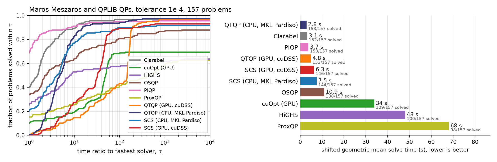

1e-4, largest quartile:

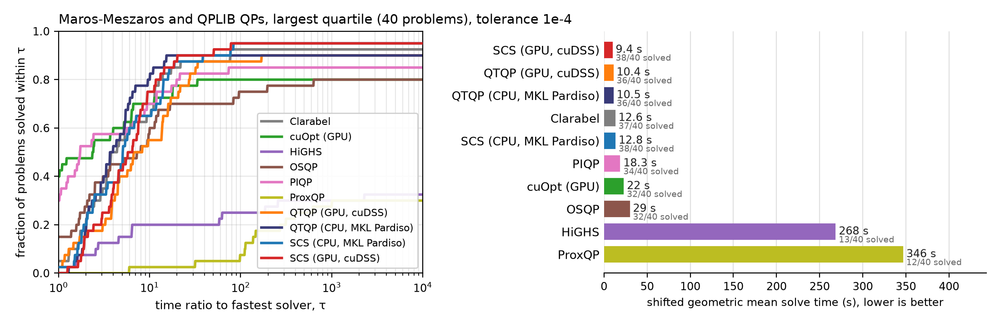

1e-5, all problems:

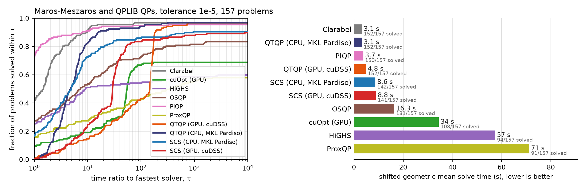

1e-5, largest quartile:

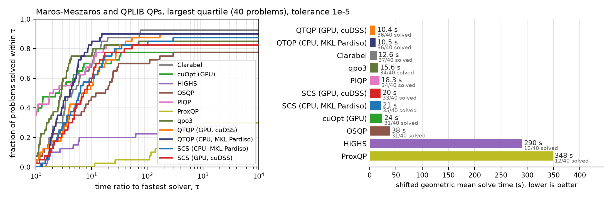

1e-6, all problems:

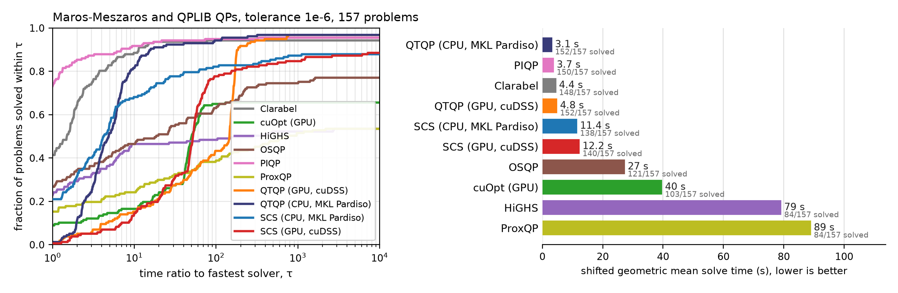

1e-6, largest quartile:

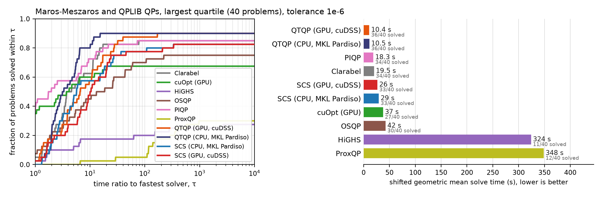

By data set at 1e-4:

| Solver | Maros-Meszaros | QPLIB |
|---|---|---|
| QTQP (CPU, MKL Pardiso) | 137/138 · 1.4 s | 16/19 · 19.7 s |
| QTQP (GPU, cuDSS) | 138/138 · 3.1 s | 15/19 · 23.5 s |
| SCS (GPU, cuDSS) | 130/138 · 4.6 s | 16/19 · 26.5 s |
| Clarabel | 136/138 · 1.2 s | 16/19 · 30.6 s |
| SCS (CPU, MKL Pardiso) | 128/138 · 5.2 s | 16/19 · 37.6 s |
| qpo3 | 138/138 · 0.5 s | 12/19 · 58.2 s |
| PIQP | 138/138 · 0.8 s | 12/19 · 66.4 s |
| OSQP | 126/138 · 7.4 s | 12/19 · 68.1 s |
| cuOpt (GPU) | 96/138 · 31.5 s | 13/19 · 54.8 s |
| HiGHS | 96/138 · 34.0 s | 4/19 · 419.7 s |
| ProxQP | 95/138 · 49.2 s | 3/19 · 561.6 s |

By data set at 1e-6:

| Solver | Maros-Meszaros | QPLIB |
|---|---|---|
| QTQP (GPU, cuDSS) | 137/138 · 3.2 s | 15/19 · 23.5 s |
| QTQP (CPU, MKL Pardiso) | 137/138 · 1.4 s | 15/19 · 26.8 s |
| Clarabel | 134/138 · 2.0 s | 14/19 · 47.5 s |
| qpo3 | 138/138 · 0.5 s | 12/19 · 58.2 s |
| PIQP | 138/138 · 0.8 s | 12/19 · 66.4 s |
| SCS (GPU, cuDSS) | 127/138 · 9.0 s | 13/19 · 60.6 s |
| SCS (CPU, MKL Pardiso) | 126/138 · 7.2 s | 12/19 · 95.6 s |
| OSQP | 110/138 · 22.4 s | 11/19 · 92.2 s |
| cuOpt (GPU) | 94/138 · 34.1 s | 9/19 · 105.4 s |
| HiGHS | 81/138 · 60.4 s | 3/19 · 482.5 s |
| ProxQP | 81/138 · 67.6 s | 3/19 · 565.3 s |

## Linear programs

Netlib (93), Kennington (16) and the 240 MIPLIB 2017 benchmark relaxations: 349 problems, 300 s limit.

| Solver | 1e-4, all | 1e-4, largest quartile | 1e-5, all | 1e-5, largest quartile | 1e-6, all | 1e-6, largest quartile |
|---|---|---|---|---|---|---|
| HiGHS | 336/349 · 5.0 s | 76/88 · 28.2 s | 336/349 · 5.0 s | 76/88 · 28.2 s | 336/349 · 5.0 s | 76/88 · 28.2 s |
| QTQP (GPU, cuDSS) | 343/349 · 6.4 s | 84/88 · 23.5 s | 342/349 · 6.5 s | 83/88 · 24.5 s | 340/349 · 6.9 s | 83/88 · 24.5 s |
| qpo3 | 326/349 · 7.3 s | 70/88 · 40.7 s | 326/349 · 7.3 s | 70/88 · 40.7 s | 326/349 · 7.3 s | 70/88 · 40.7 s |
| QTQP (CPU, MKL Pardiso) | 332/349 · 8.7 s | 73/88 · 60.7 s | 332/349 · 8.7 s | 73/88 · 60.7 s | 330/349 · 9.1 s | 73/88 · 60.7 s |
| PIQP | 316/349 · 9.3 s | 63/88 · 51.5 s | 314/349 · 9.7 s | 63/88 · 51.5 s | 310/349 · 10.6 s | 63/88 · 51.5 s |
| Clarabel | 324/349 · 10.5 s | 68/88 · 73.5 s | 316/349 · 12.4 s | 64/88 · 86.0 s | 312/349 · 13.4 s | 63/88 · 88.9 s |
| SCS (GPU, cuDSS) | 320/349 · 11.3 s | 77/88 · 35.6 s | 315/349 · 12.8 s | 75/88 · 37.4 s | 303/349 · 17.0 s | 70/88 · 48.6 s |
| SCS (CPU, MKL Pardiso) | 316/349 · 11.9 s | 71/88 · 56.5 s | 311/349 · 14.2 s | 70/88 · 62.6 s | 295/349 · 19.9 s | 61/88 · 84.7 s |
| PDLP (OR-Tools) | 292/349 · 24.5 s | 52/88 · 139.0 s | 284/349 · 30.2 s | 49/88 · 164.1 s | 263/349 · 38.6 s | 40/88 · 221.3 s |
| OSQP | 257/349 · 42.2 s | 43/88 · 220.1 s | 215/349 · 76.9 s | 32/88 · 363.3 s | 174/349 · 131.9 s | 21/88 · 474.3 s |
| cuOpt (GPU) | 219/349 · 45.7 s | 25/88 · 255.6 s | 217/349 · 47.4 s | 24/88 · 265.4 s | 204/349 · 56.9 s | 20/88 · 322.6 s |

1e-4, all problems:

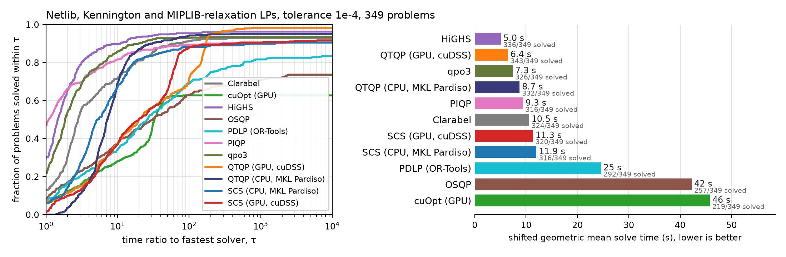

1e-4, largest quartile:

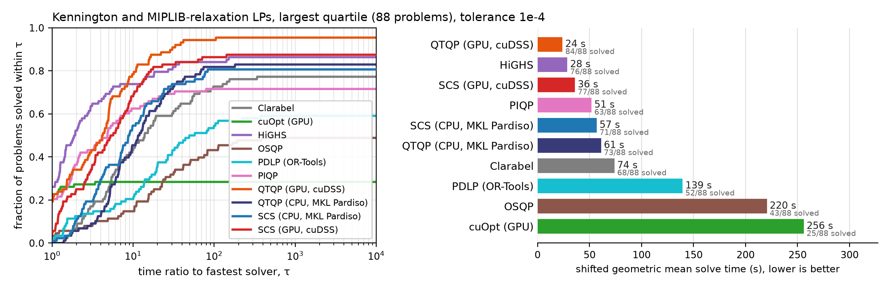

1e-5, all problems:

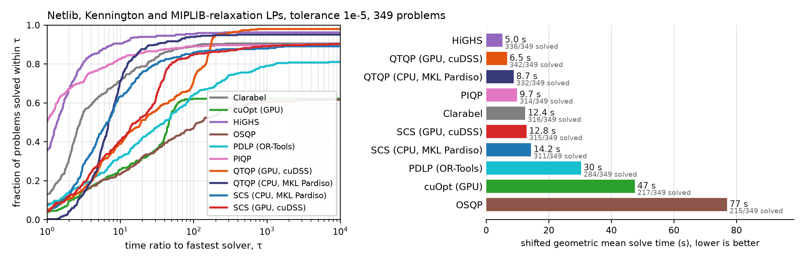

1e-5, largest quartile:

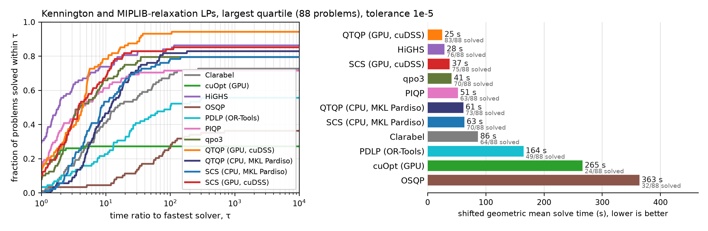

1e-6, all problems:

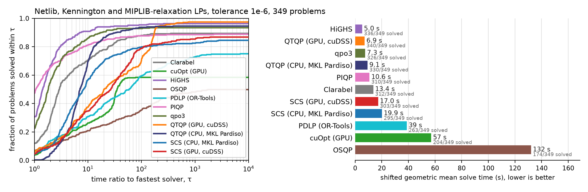

1e-6, largest quartile:

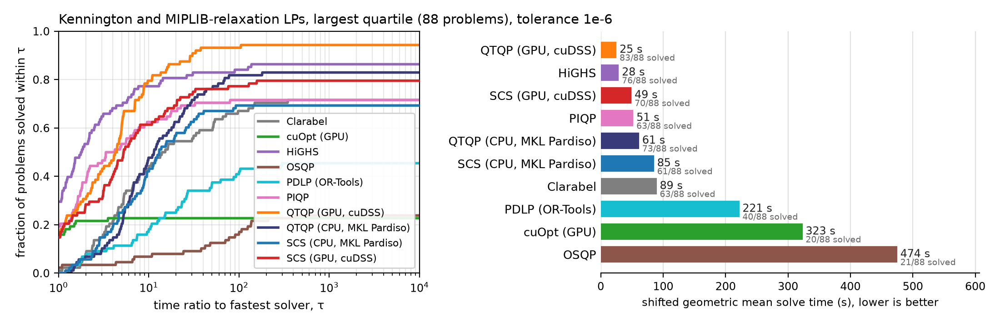

By data set at 1e-4:

| Solver | Kennington | MIPLIB 2017 relaxations | Netlib |
|---|---|---|---|
| HiGHS | 16/16 · 1.7 s | 227/240 · 7.7 s | 93/93 · 0.2 s |
| QTQP (GPU, cuDSS) | 16/16 · 6.3 s | 234/240 · 8.6 s | 93/93 · 1.9 s |
| PIQP | 16/16 · 5.1 s | 210/240 · 13.6 s | 90/93 · 2.1 s |
| QTQP (CPU, MKL Pardiso) | 16/16 · 7.6 s | 223/240 · 13.5 s | 93/93 · 0.4 s |
| qpo3 | 15/16 · 15.0 s | 220/240 · 9.9 s | 91/93 · 1.3 s |
| Clarabel | 15/16 · 13.5 s | 218/240 · 15.5 s | 91/93 · 1.5 s |
| SCS (CPU, MKL Pardiso) | 15/16 · 26.3 s | 217/240 · 13.9 s | 84/93 · 6.1 s |
| SCS (GPU, cuDSS) | 14/16 · 30.3 s | 224/240 · 11.4 s | 82/93 · 8.7 s |
| PDLP (OR-Tools) | 15/16 · 23.4 s | 188/240 · 34.9 s | 89/93 · 7.6 s |
| OSQP | 12/16 · 70.5 s | 172/240 · 49.6 s | 73/93 · 24.4 s |
| cuOpt (GPU) | 6/16 · 160.2 s | 127/240 · 77.0 s | 86/93 · 4.6 s |

By data set at 1e-6:

| Solver | Kennington | MIPLIB 2017 relaxations | Netlib |
|---|---|---|---|
| HiGHS | 16/16 · 1.7 s | 227/240 · 7.7 s | 93/93 · 0.2 s |
| QTQP (GPU, cuDSS) | 16/16 · 6.3 s | 231/240 · 9.4 s | 93/93 · 1.9 s |
| QTQP (CPU, MKL Pardiso) | 16/16 · 7.6 s | 221/240 · 14.3 s | 93/93 · 0.4 s |
| PIQP | 16/16 · 5.1 s | 204/240 · 15.8 s | 90/93 · 2.1 s |
| qpo3 | 15/16 · 15.0 s | 220/240 · 9.9 s | 91/93 · 1.3 s |
| Clarabel | 15/16 · 13.5 s | 208/240 · 19.8 s | 89/93 · 2.6 s |
| SCS (GPU, cuDSS) | 14/16 · 36.7 s | 211/240 · 16.9 s | 78/93 · 14.8 s |
| SCS (CPU, MKL Pardiso) | 12/16 · 49.6 s | 205/240 · 21.8 s | 78/93 · 12.7 s |
| cuOpt (GPU) | 8/16 · 87.9 s | 113/240 · 101.4 s | 83/93 · 6.8 s |
| PDLP (OR-Tools) | 9/16 · 137.5 s | 171/240 · 50.1 s | 83/93 · 13.2 s |
| OSQP | 9/16 · 146.7 s | 126/240 · 121.4 s | 39/93 · 160.3 s |

## Large linear programs: the Mittelmann set

Hans Mittelmann's LP benchmark set: 37 problems, 1800 s limit, 64 GB containers.

| Solver | 1e-4, all | 1e-4, largest quartile | 1e-5, all | 1e-5, largest quartile |
|---|---|---|---|---|
| QTQP (GPU, cuDSS) | 27/37 · 192.0 s | 3/10 · 1775.6 s | 26/37 · 215.4 s | 3/10 · 1775.6 s |
| SCS (GPU, cuDSS) | 28/37 · 207.5 s | 3/10 · 1633.4 s | 23/37 · 389.7 s | 3/10 · 1759.6 s |
| SCS (CPU, MKL Pardiso) | 24/37 · 431.3 s | 2/10 · 3247.6 s | 20/37 · 695.7 s | 2/10 · 3428.8 s |
| QTQP (CPU, MKL Pardiso) | 23/37 · 466.8 s | 2/10 · 3320.5 s | 22/37 · 485.5 s | 2/10 · 3320.5 s |
| qpo3 | 19/37 · 679.9 s | 4/10 · 1643.0 s | 19/37 · 679.9 s | 4/10 · 1643.0 s |
| PDLP (OR-Tools) | 19/37 · 732.7 s | 1/10 · 4717.2 s | 14/37 · 1225.5 s | 1/10 · 4717.2 s |
| Clarabel | 20/37 · 817.0 s | 2/10 · 3453.8 s | 20/37 · 817.0 s | 2/10 · 3453.8 s |
| PIQP | 12/37 · 1352.2 s | 1/10 · 3797.8 s | 12/37 · 1352.2 s | 1/10 · 3797.8 s |
| cuOpt (GPU) | 7/37 · 2086.0 s | 1/10 · 2955.0 s | 4/37 · 3050.0 s | 1/10 · 2954.2 s |
| HiGHS | 9/37 · 2888.8 s | 1/10 · 3444.0 s | 9/37 · 2888.8 s | 1/10 · 3444.0 s |

1e-4, all problems:

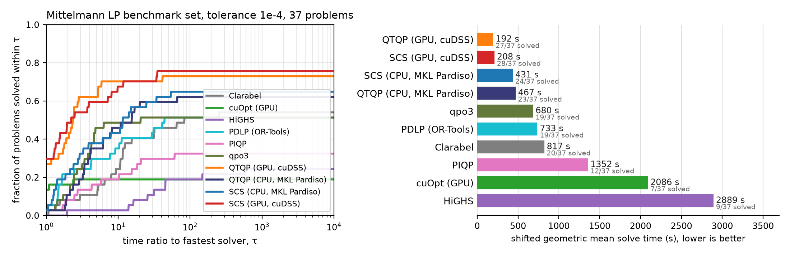

1e-4, largest quartile:

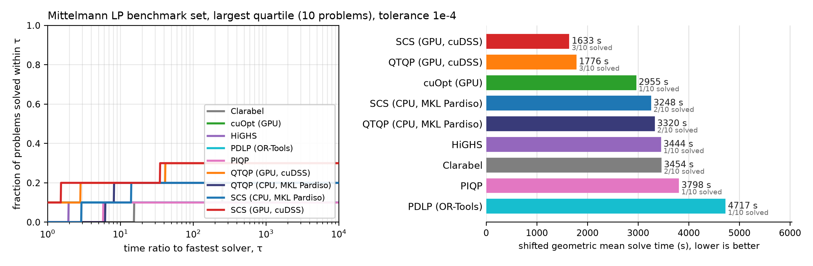

1e-5, all problems:

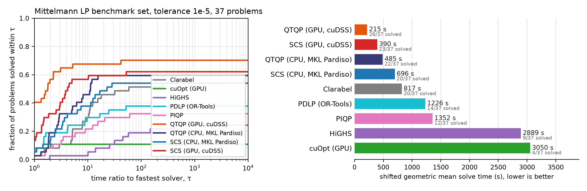

1e-5, largest quartile:

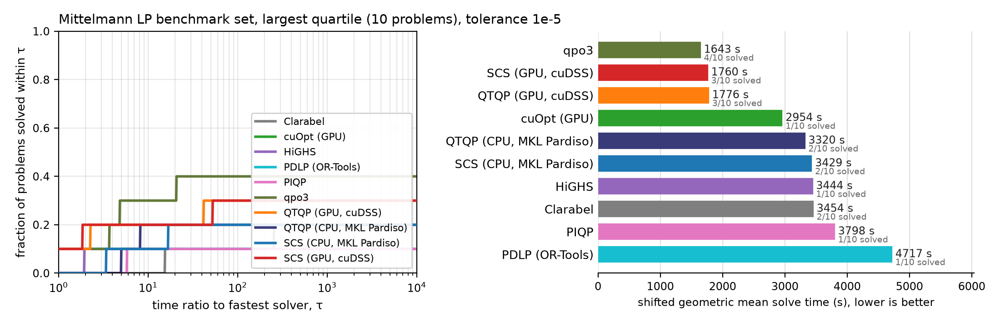

By data set at 1e-4:

| Solver | Mittelmann |
|---|---|
| SCS (GPU, cuDSS) | 28/37 · 207.5 s |
| SCS (CPU, MKL Pardiso) | 24/37 · 431.3 s |
| qpo3 | 19/37 · 679.9 s |
| PDLP (OR-Tools) | 19/37 · 732.7 s |
| Clarabel | 20/37 · 817.0 s |
| cuOpt (GPU) | 7/37 · 2086.0 s |

## Semidefinite programs

SDPLIB (88 feasible instances) and the Mittelmann SDPs (6): 94 problems, 900 s limit. SCS cuDSS was run at 1e-4 only on this family.

| Solver | 1e-4, all | 1e-4, largest quartile | 1e-6, all | 1e-6, largest quartile |
|---|---|---|---|---|
| SDPA | 75/94 · 38.2 s | 21/24 · 38.6 s | 69/94 · 58.6 s | 21/24 · 38.6 s |
| CVXOPT | 76/94 · 52.4 s | 18/24 · 111.5 s | 62/94 · 132.5 s | 16/24 · 178.6 s |
| Clarabel | 71/94 · 68.9 s | 13/24 · 257.0 s | 69/94 · 75.7 s | 12/24 · 283.1 s |
| SCS (CPU, MKL Pardiso) | 77/94 · 107.5 s | 14/24 · 1090.7 s | 51/94 · 274.0 s | 2/24 · 2455.8 s |
| SCS (GPU, cuDSS) | 73/94 · 146.5 s | 9/24 · 1531.0 s | – | – |

1e-4, all problems:

1e-4, largest quartile:

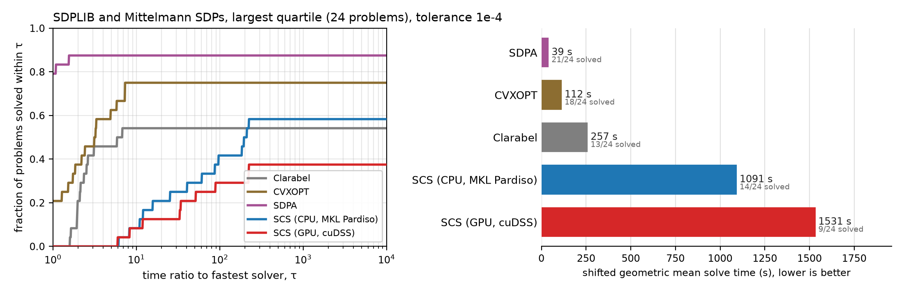

1e-6, all problems:

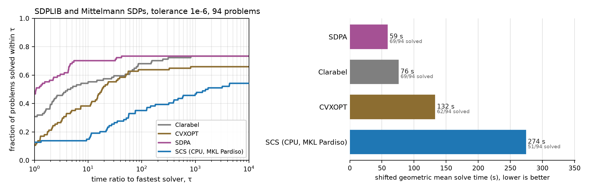

1e-6, largest quartile:

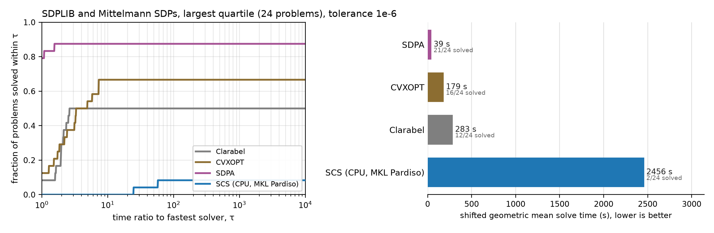

By data set at 1e-4:

| Solver | Mittelmann SDPs | SDPLIB |
|---|---|---|
| Clarabel | 5/6 · 81.1 s | 66/88 · 68.1 s |
| SDPA | 3/6 · 260.6 s | 72/88 · 32.8 s |
| SCS (CPU, MKL Pardiso) | 3/6 · 405.4 s | 74/88 · 97.8 s |
| SCS (GPU, cuDSS) | 3/6 · 545.6 s | 70/88 · 133.6 s |
| CVXOPT | 3/6 · 678.6 s | 73/88 · 43.0 s |

By data set at 1e-6:

| Solver | Mittelmann SDPs | SDPLIB |
|---|---|---|
| Clarabel | 4/6 · 122.3 s | 65/88 · 73.2 s |
| SDPA | 2/6 · 651.8 s | 67/88 · 48.8 s |
| CVXOPT | 3/6 · 678.6 s | 59/88 · 118.0 s |
| SCS (CPU, MKL Pardiso) | 2/6 · 966.6 s | 49/88 · 251.0 s |
| SCS (GPU, cuDSS) | 0/6 · 2700.0 s | 0/88 · 2700.0 s |

## Infeasible and unbounded problems

Netlib's 29 infeasible LPs (two of them also dual infeasible) and SDPLIB's four infeasible SDPs (two primal infeasible, two unbounded); small problems, a median of 460 variables. SCS, Clarabel, OSQP, PDLP, CVXOPT and QTQP return a certificate (a Farkas ray), checked from the problem data at the 1e-3 threshold; HiGHS, PIQP, cuOpt and SDPA report a status only. A verified certificate of either kind counts as correct; "near-feasible" is an optimal claim whose residuals pass the check (the instance is infeasible by less than the tolerance). The plot shows the certificate-producing solvers, each from the run in which it certified the most (SCS, Clarabel and OSQP at a solve tolerance of 1e-8 with certificate tolerance 1e-4, QTQP at 1e-8, PDLP at 1e-5 with its default certificate tolerance); a verified certificate counts as a solve. qpo3 detects most of these in its presolve: 19 of its 28 certificates are produced at zero interior-point iterations, in about a millisecond, which is why its time is so low; the "presolve off" row shows the same solver certifying with the interior-point iterations alone. Both are genuine Farkas certificates of the original problem, checked the same way as everyone else's.

### Netlib infeasible LPs

29 problems.

| Solver | certified | status only | unverified | near-feasible | wrong | no answer | geomean time |
|---|---|---|---|---|---|---|---|
| SCS (CPU, MKL Pardiso), 1e-4 | 24 | 0 | 0 | 2 | 3 | 0 | 0.20 s |
| SCS (CPU, MKL Pardiso), 1e-8 (infeasibility tolerance 1e-4) | 26 | 0 | 0 | 1 | 1 | 1 | 0.44 s |
| SCS (GPU, cuDSS), 1e-8 (infeasibility tolerance 1e-4) | 25 | 0 | 0 | 1 | 1 | 2 | 0.93 s |
| Clarabel, 1e-8 (infeasibility tolerance 1e-4) | 27 | 0 | 1 | 1 | 0 | 0 | 0.35 s |
| QTQP (CPU, MKL Pardiso), 1e-8 | 28 | 0 | 0 | 1 | 0 | 0 | 0.33 s |
| QTQP (GPU, cuDSS), 1e-8 | 28 | 0 | 0 | 1 | 0 | 0 | 2.78 s |
| qpo3, 1e-8 (infeasibility tolerance 1e-4) | 28 | 0 | 0 | 0 | 0 | 1 | 0.01 s |
| qpo3, presolve off, 1e-8 (infeasibility tolerance 1e-4) | 28 | 0 | 0 | 0 | 0 | 1 | 0.25 s |
| PIQP, 1e-6 | 0 | 17 | 0 | 0 | 0 | 12 | 0.29 s |
| HiGHS, 1e-6 | 0 | 26 | 0 | 0 | 0 | 3 | 0.02 s |
| OSQP, 1e-8 | 19 | 0 | 0 | 0 | 0 | 10 | 1.68 s |
| PDLP (OR-Tools), 1e-5 | 22 | 0 | 2 | 0 | 0 | 5 | 10.91 s |
| cuOpt (GPU), 1e-4 | 0 | 27 | 0 | 0 | 1 | 1 | 0.40 s |

### SDPLIB infeasible SDPs

4 problems.

| Solver | certified | status only | unverified | near-feasible | wrong | no answer | geomean time |
|---|---|---|---|---|---|---|---|
| SCS (CPU, MKL Pardiso) | 4 | 0 | 0 | 0 | 0 | 0 | 0.04 s |
| SCS (GPU, cuDSS) | 4 | 0 | 0 | 0 | 0 | 0 | 0.70 s |
| Clarabel (infeasibility tolerance 1e-4) | 4 | 0 | 0 | 0 | 0 | 0 | 0.20 s |
| CVXOPT | 0 | 0 | 2 | 0 | 2 | 0 | – |
| SDPA | 0 | 4 | 0 | 0 | 0 | 0 | 0.03 s |
